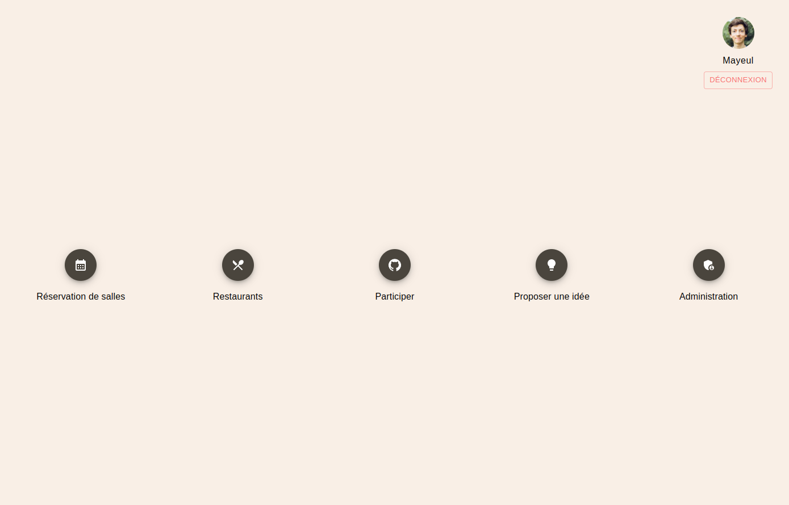

# Galadrim Rooms



see some other sample images [here](./readme-images/README.md)

## Setup

-   for the backend you will need a mysql database ([docker setup](#-Docker-mysql-database))
-   yarn install

## Environment

on the frontend you need to create a `.env` you can copy and use the default [.env.example](./apps/frontend/.env.example)

```
VITE_API_URL=http://localhost:3000/api
VITE_SOCKET_API_URL=http://localhost:3333
```

on the backend you need to create a `.env` you can copy and modify [.env.example](./apps/backend/.env.example)

the part you will need to adapt is the database connection settings

```
MYSQL_HOST
MYSQL_PORT
MYSQL_USER
MYSQL_PASSWORD
MYSQL_DB_NAME
```

## Database

### Docker mysql database

if you have docker/docker-compose installed, you can run
it will launch a mysql server on the port 3310 you can edit this in [docker-compose.yml](./docker-compose.yml)

-   `docker-compose up`

### database setup

-   `cd ./apps/backend`
-   `node ace migration:run`
-   `node ace db:seed`

## Start project

-   at the root of the project run:
    `nx dev backend`
    and
    `nx dev frontend`

-   go to http://localhost:3000

-   login with the login / password of any of the users defined in this [seeder file](./apps/backend/database/seeders/001_UserSeeder.ts)

## Adonis CLI tool

on the backend you have access to a node script file `ace`:
`cd ./apps/backend`
`node ace --help`

you can read documentation about it [here](https://docs.adonisjs.com/guides/ace-commandline)

some commands that you could need

```sh
# display all API routes with controller method used
node ace list:routes

# start a read-eval-print-loop with your project loaded
node ace repl
```

[adonis repl documentation](https://docs.adonisjs.com/guides/repl)

## Test project

When you write complex logic, try to write tests

to test project you can run those nx commands
(nx commands needs to be run at the root of the project)

`nx test backend`
`nx test frontend`
`nx test shared`

## Build project

(nx will build dependants projects if needed)

`nx build backend`
`nx build frontend`

## Contributing

-   fork the repo
-   create a branch: `git checkout -b feat/awesomeNewFeature`
-   commit and push your changes
-   make sure project can be built without errors, and tests still pass
-   create pull request
